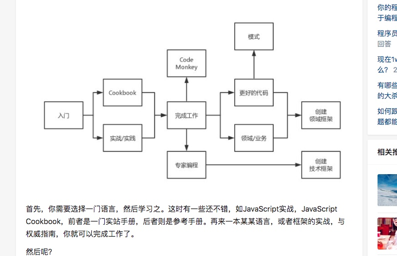

1、数据的复杂度要比程序的复杂度好控制

具体的来说，数据能够控制的复杂度，不要交给代码去控制

2、关键服务的for循环单个循环不能影响主体

书单：

技术的本质

如何写好代码——重构与设计模式

易读代码的艺术/编写可读代码的艺术

设计模式解析

《[深入浅出设计模式](https://link.zhihu.com/?target=http%253A//t.cn/zOnvX9N)》
--------------------------------------------------------------------

